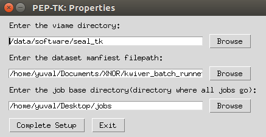
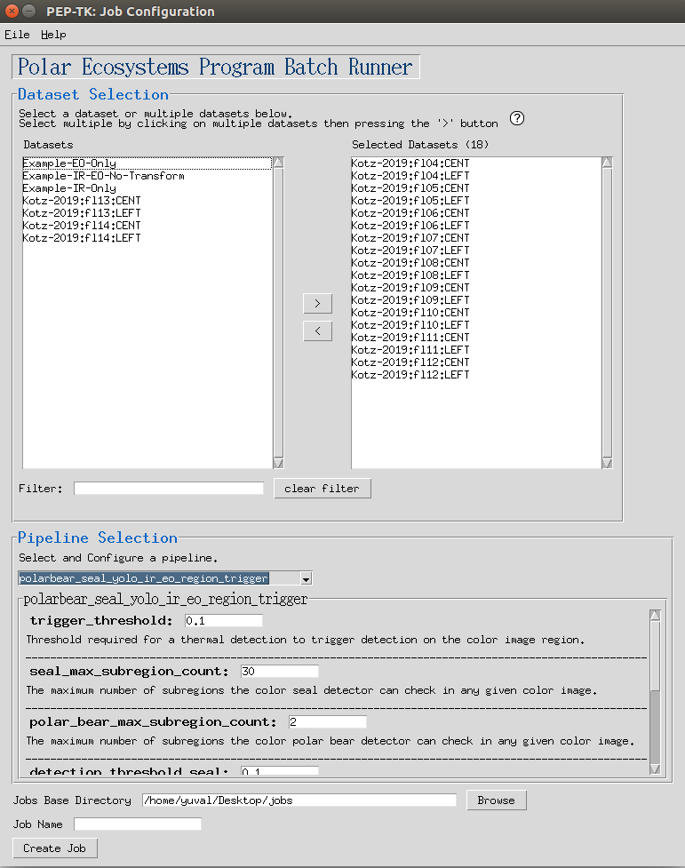
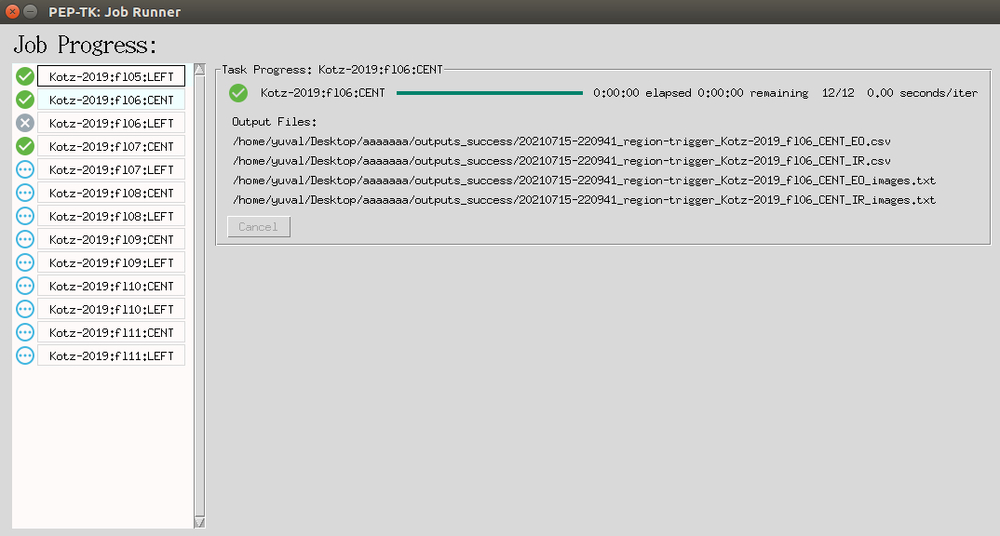

<h1>Polar Ecosystems Program GUI</h1>

#### Table of Contents
  * [Terminology](#terminology)
  * [The GUI](#the-gui)
    + [- Setup -](#--setup--)
    + [- Configuring the application preferences -](#--configuring-the-application-preferences--)
    + [- Creating a Job -](#--creating-a-job--)
    + [- Resuming a job -](#--resuming-a-job--)
    + [- Job progress -](#--job-progress--)
    + [- Job outputs -](#--job-outputs--)
  * [Dataset Manifest](#dataset-manifest)
    + [- Dataset attributes -](#--dataset-attributes--)
    + [- Example 1 (CSV Format) -](#--example-1-csv-format--)
    + [- Example 2 (INI Format) -](#--example-2-ini-format--)
    + [- Example 3 (Relative Paths) -](#--example-3-relative-paths--)
    + [- Future features -](#--future-features--)


#### Terminology
 - **Task** - a task is a unit of work in the GUI and is comprised of running a single dataset through a pipeline.
 - **Job** - a job is one or more tasks, so a job is comprised of running one or more datasets through a pipeline.
 - **Dataset** - a dataset is an image list or a set of image lists which point to images in the dataset.  Images within an image list can be in different directories, or two dataset's image lists could all point to images in the same directory (for example for splitting test and non-test data).  See [Dataset Manifest](#dataset-manifest) for details.
## The GUI
### - Setup -
This GUI runs kwiver pipelines using VIAME's underlying kwiver.  Some pipelines(anything requiring a transformation file) 
may require kwiver plugins only available in the SEAL-TK distribution.  
Binaries for SEAL-TK or VIAME can be found [here](https://github.com/VIAME/VIAME/#installations).

Since model files are large, to checkout with git you will also need to install [Git LFS](https://git-lfs.github.com/).

```bash
git clone https://github.com/readicculus/pep_gui.git # clone the repository
cd pep_gui                                           # cd into project
git lfs pull                                         # pull the model files using Git LFS
pip install -r requirements.txt                      # install project dependencies
```

### - Configuring the application preferences -
When the application is launched for the first time you will be prompted to configure the following properties.
After that, to modify these properties, go to `File > Properties`.
Here you can set:
- Which SEAL-TK directory to use.
- Which dataset manfieset file to use.
- The base directory for jobs (new jobs will be created in `/path/to/job_base_dir/`)


### - Creating a Job -


When you first launch the program you will be brought to a page to create a job.  To create a job:
1. Select which datasets you want to run
2. Select which pipeline to use
3. Select a unique name for your job

### - Resuming a job -
Resuming a job is usefil if for some reason the GUI or machine you are on crashes mid-job.  In addition if for some reason you were to cancel some tasks in a job, and decide you want to run them later, resuming will re-run any cancelled tasks.
To resume a Job click `File > Resume Job` which will open a prompt to select a folder.  Select the folder of the job you would like to resume.

_Since a task is the smallest unit of work, if a task fails half way through, resuming a job will re-run that task from the beginning.  If a task is successful resuming a job will not re-run that task._ 

### - Job progress -


The job progress GUI allows you to track individual task's progress, to cancel a task, and to see metrics such as seconds/iteration and estimated time to completion.
### - Job outputs -
#### Pipeline outputs (processed image lists/detections)
1. When a task is running, the task's outputs will be written to `job_base_dir/job_name/outputs_pending/`.
2. When a task is cancelled or an error occurs the task's output files will be moved to `job_base_dir/job_name/outputs_error/`.
3. When a task is successfully completed the task's output files will be moved to  `job_base_dir/job_name/outputs_success/`.
#### Logs
The `job_base_dir/job_name/logs/` directory contains the underlying kwiver outputs and application logs which are helpful for debugging purposes


## Dataset Manifest
The dataset manifest is a file that defines all of the datasets available in csv or ini format.  When creating a job you will be able to select and filter which datasets from the dataset manifest to run.

This format allows us to organize datasets as arbitrary hierarchies.  

### - Dataset attributes -
Currently a dataset must have one or more of the following attributes:
- `dataset_name` - a unique name for this dataset **(required and unique)**
- `color_image_list` - the color image list txt file **(one required)**
- `thermal_image_list` - the thermal image list txt file **(one required)**
    
Additional optional attributes are:
- `transformation_file` - the .h5 transformation file **(optional)**

### - Example 1 (CSV Format) -
This format requires `.csv` file extension.
```csv
dataset_name, color_image_list, thermal_image_list, transformation_file
Kotz-2019-fl04-CENT, /path/to/kotz/fl04/CENT/color_images.txt, /path/to/kotz/fl04/CENT/thermal_images.txt, /path/to/Homographies/A90_RGB-IR_C_100mm_0deg_20190509_fl4.h5
Kotz-2019-fl04-LEFT, /path/to/kotz/fl04/LEFT/color_images.txt, /path/to/kotz/fl04/LEFT/thermal_images.txt, /path/to/Homographies/A90_RGB-IR_L_100mm_25deg_20190509-11_fl4-7.h5
```
This example defines 2 datasets, exactly the same as the INI example below, which we can select from in the GUI for running pipelines.
```
Kotz-2019-fl04-CENT
Kotz-2019-fl04-LEFT
```

### - Example 2 (INI Format) -
Can use file extension `.ini` or `.cfg` for this format.  The datset_name in INI format is provided by the section name in brackets as shown below.
```ini
[Kotz-2019-fl04-CENT]
thermal_image_list=/path/to/kotz/fl04/CENT/thermal_images.txt
color_image_list=/path/to/kotz/fl04/CENT/thermal_images.txt
transformation_file=/path/to/Homographies/A90_RGB-IR_C_100mm_0deg_20190509_fl4.h5

[Kotz-2019-fl04-LEFT]
thermal_image_list=/path/to/kotz/fl04/LEFT/thermal_images.txt
color_image_list=/path/to/kotz/fl04/LEFT/thermal_images.txt
transformation_file=/path/to/Homographies/A90_RGB-IR_L_100mm_25deg_20190509-11_fl4-7.h5
```
This example defines 2 datasets, exactly the same as the CSV example above, which we can select from in the GUI for running pipelines.
```
Kotz-2019-fl04-CENT
Kotz-2019-fl04-LEFT
```

### - Example 3 (Relative Paths) -
You can use absolute or relative paths.  If using relative paths, the relative path must be relative to the manifest file.
```ini
; if this manifest is located at '/path/to/kotz/manifest.cfg'
; then the two below are equivalent
[Kotz-2019-fl04-CENT-relative]
thermal_image_list=fl04/CENT/thermal_images.txt
color_image_list=fl04/CENT/thermal_images.txt
transformation_file=/path/to/Homographies/A90_RGB-IR_C_100mm_0deg_20190509_fl4.h5

[Kotz-2019-fl04-CENT-absolute]
thermal_image_list=/path/to/kotz/fl04/CENT/thermal_images.txt
color_image_list=/path/to/kotz/fl04/CENT/thermal_images.txt
transformation_file=/path/to/Homographies/A90_RGB-IR_L_100mm_25deg_20190509-11_fl4-7.h5
```
### - Future features -
  - Ability to define a set of images using wildcards instead of having to define an image list. ex `thermal_image_list: /path/to/kotz/fl04/CENT/*_ir.tif`
